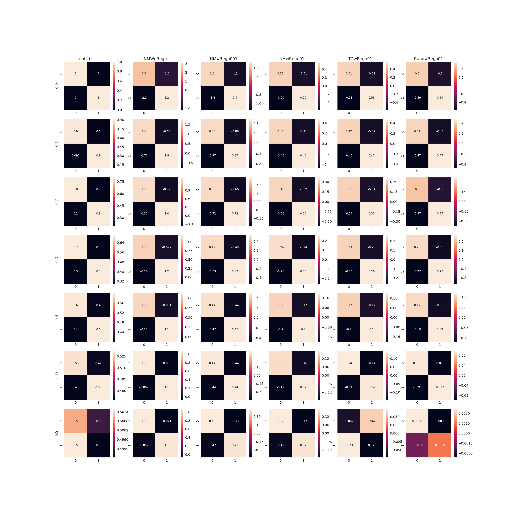
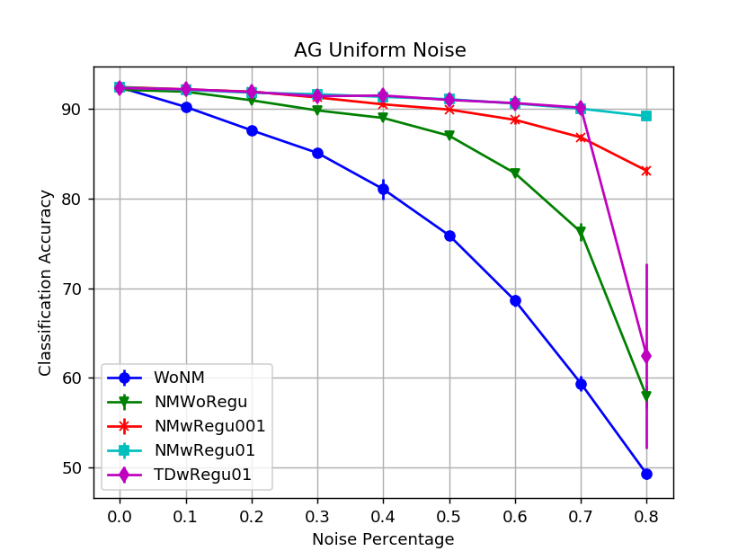
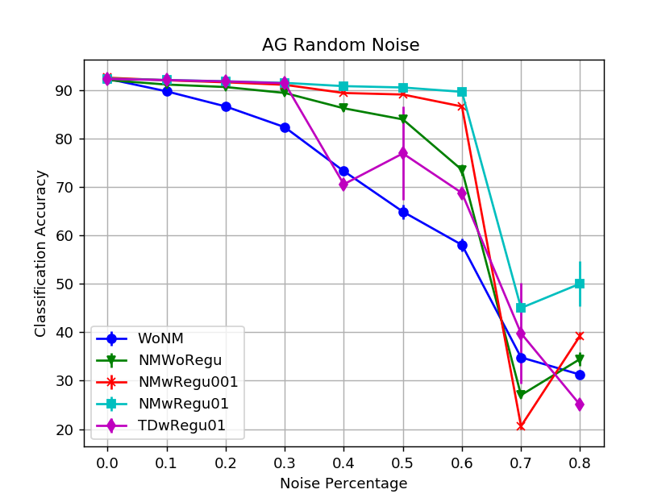
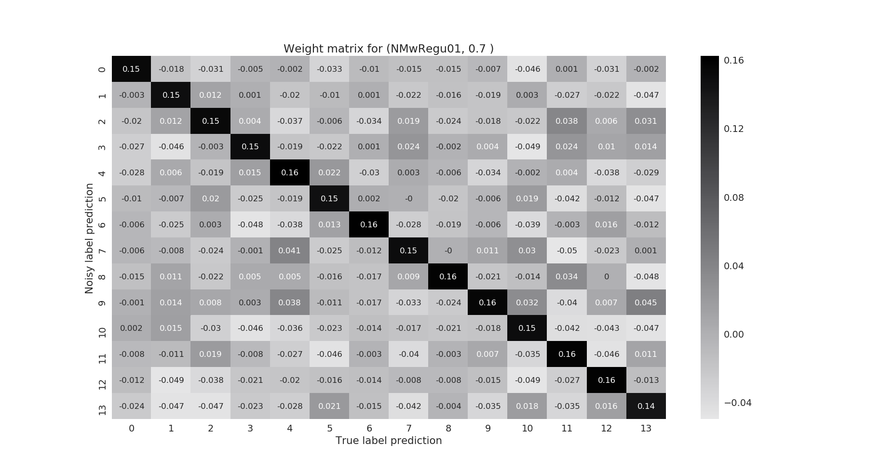

# Classification in the presence of label noise.

Run label noise experiments via:
```
python main.py --config ~/baseline/python/mead/config/sst2.json  --noisemodel ~/baseline/noisylabel/noise_model_py.json --noisetype uni --noiselvl 0.0 0.1 0.2 0.3 0.4 0.45 
```

- `--config` specifies the Baseline configuration for a dataset.
- `--noisemodel` specifies the types of noise model one wants to try. Different models we used in our experiments include `WoNM`, `NMWoRegu`, `NMwRegu01` etc. Further information on this can be found under types of experiments. `noise_model_py.json` contains information for all the models. 
- `--noisetype` Default is uniform label noise (uni). One can choose among ['uni', 'rand', 'cc'].
- `--noiselvl` specify the level of artificial label noise injected into the datasets. can got from 0.0 --> 0.9
- `--nmScale` defines the scaling factor of noise model initialization. Default is identity matrix. 

## Types of Experiments

- **Different datasets**: Explored different types of text classification datasets ranging from binary classification to multi-class classification problem.
    + SST2 (2 classes)
    + Trec (6 classes)
    + AG-News (4 classes)
    + Dbpedia (14 classes)
- **Effect of noise types**
    + **Uniform label flipping (Uni)**: A clean label is swapped with another label from the given number of labels sampled uniformly at random.
    + **Structured label flipping (Rand)**: A clean label id swapped with another label from the given number of labels-
        * *Random order of flipping*: sampled randomly over a unit simplex. 
        * *Increasing order of flipping*: sampled randomly over a unit simplex but with increasing order of confusions.
    + **Class Conditional label flipping (CC)**: A clean label form one class is specifically swapped with label from another class. We find the most confused labels by testing the trained base model on clean dataset.
- **Effect of batch sizes**
    + Here we studied the effect of batch size on different datasets with different types of label noise.
- **Effect of noise models**
    + `WoNM` :  Without Noise Model; No noise model stacked to the network.
    + `NMWoRegu`:  Noise Model Without Regularization; Noise model is stacked on top of base model but no regularization applied and noise model's weights are initialized to identity.
    + `NMwRegu01`:  A noise model with l2 regularization (penalty 0.1) stacked and noise model's weights are initialized to identity.
    + `NMwRegu001`: A noise model with l2 regularization (penalty 0.01) stacked and noise model's weights are initialized to identity.
    + `TDwRegu001`: A noise model with l2 regularization (penalty 0.01) stacked and noise model's weights are initialized to True noise distribution injected to the labels.
    + `RandwRegu01`: A noise model with l2 regularization (penalty 0.01) stacked and noise model's weights are initialized randomly.
    + `NMwl1Regu001`: A noise model with l1 regularization (penalty 0.01) stacked and noise model's weights are initialized to identity.
    + `NMwl1l2Regu001`: A noise model with l2-l1 (elastic net) regularization (penalty 0.01) stacked and noise model's weights are initialized to identity.


# Experiments

### SST2 Dataset

- Binary classification problem.
- Dataset used: SST2 Sentiment analysis with with 76961 training samples and 1821 test samples. We define the `Base Model` as a Neural Network network (CNN/LSTM) without any noise modeling component attached to it.
- Number of training samples per class are different as shown here: [34702, 42259].


- Training:
    * Optimizer `AdaDelta`
    * Batch_Size: 50, 100, 300
    * Epoches: 20
    * Trials: All the data points in the plot are averaged over 5 trials

- Run experiments for `[00, 10, 20, 30, 40, 47, 50]` percentage of noise with early stopping. Here is the resulting classification accuracy plot having different batch sizes. We vary the batch size as `[50, 100, 300]`.
- On base model with clean labels we obtain classification accuracy of `87.27%` when implemented on `Pytorch`.

| Batch Size | Accuracy Plot |Accuracy plot with variance| 
|:---:|:---:|:---:|
|50|| |
|50|| |
|100|| |
|300|| |

Random guess [50%]


- The plots for the noise distribution injected to the labels and the last layer weights of the noise model. [_**Raw Weights**_](./images/SST2All_last_layerWeigh.png)

<!--  -->

Here, To observe the effect of batch size on the individual model performance we plot the classification accuracy for a particular model vs the different batch size. 

**Observations:**

- It is observed that for the binary classification problem, in almost all the models the `large batch size` does` significantly improves the performance` only when the `labels are highly unreliable`.
-  For the smaller noise levels (say <30%), it is very `hard` to choose the `best batch size`.
-  Except in the case for model `NMwRegu01`, we noted the performance improvement over all the noise levels when batch size `100` is used.

| `WoNM` | `NMW0Regu` |
|:---:|:---:|
||| 
|`NMwRegu001`| `NMwRegu01`|
|||
|`TDwRegu01`| ` `|
|| |
| | |


### TREC Dataset

- Multi-class classification problem with 6 classes.
- Dataset used: Trec Question classification with 5000 training samples and 500 test samples. We define the `Base Model` as a Neural Network network (CNN/LSTM) without any noise modeling component attached to it.
- Number of training samples per class are different as shown here: [1135, 1142, 814, 766, 1064, 79].


- Basis Description:
    * Same  `trec-cnn.yml` from baseline

- Training:
    * Optimizer `Adadelta`
    * batch_Size: 10, 50
    * Epoches: 20
    * Trials: 5

- Run experiments for `[00, 10, 20, 30, 40, 50, 60, 70]` percentage of noise with early stopping. Here is the resulting classification accuracy plots when the labels are corrupted with `Random` and `Uniform` noise for different batch sizes.


<!--  -->
<!--  -->

| Batch Size | 10 | 50|
|:---:|:---:|:---:|
|**Uniform**|| |
|**Random**|| |

We obtain better results when the noise model initialized with heavy weights (in this case = `n_cls`)

| Batch Size | Uniform | Random|
|:---:|:---:|:---:|
|**10**|| |


These are the same plots as above including the trial variance.

| Batch Size | 10 | 50|
|:---:|:---:|:---:|
|**Uniform**|| |
|**Random**|| |


| Batch Size |   10 |50| 
|:---:|:---:|:---:|
|**R Vs. U**|  |  |

This compares the heavy weight diagonal initialization to normal identity matrix. This type of biasing toward the true class helps the noise model learn better representations in feature space.

| Batch Size | 10 | Heavy Weight Initialization|
|:---:|:---:|:---:|
|**Uniform**|| |
|**Random**|| |

Random guess [17%]


| `WoNM` | `NMW0Regu` |
|:---:|:---:|
||| 
|`NMwRegu001`| `NMwRegu01`|
|||
|`TDwRegu01`| ` `|
|| |
| | |

- Here are the plots for the noise distribution injected to the labels and the last layer weights of the noise model. 


| Batch Size |   Raw Weights |Softmaxed weights| 
|:---:|:---:|:---:|
|10 Uniform| [_**Raw Weights**_](./images/TrecB10U_Weights.png)| [_**Softmaxed Weights**_](./images/TrecB10U_Weights_soft.png)|
|50 Uniform| [_**Raw Weights**_](./images/TrecB50U_Weights.png)| [_**Softmaxed Weights**_](./images/TrecB50U_Weights_soft.png)|
|10 Random| [_**Raw Weights**_](./images/TrecB10R_Weights.png)| [_**Softmaxed Weights**_](./images/TrecB10R_Weights_soft.png)|
|50 Random| [_**Raw Weights**_](./images/TrecB50R_Weights.png)| [_**Softmaxed Weights**_](./images/TrecB50R_Weights_soft.png)|

[_**Softmaxed Weights**_](./images/TrecAll_last_layerWeighSoft.png)

<!-- [_Softmaxed Weights_]
 -->

### AG-news Dataset

- Multi-class classification problem with 4 different classes.
- Dataset used: AG-news Question classification with 110K training samples and 10K test samples. We define the `Base Model` as a Neural Network network (CNN/LSTM) without any noise modeling component attached to it.
- Number of training samples per class are more or less similar as shown here: `[27498, 27599, 27408, 27495]`.


- Basis Description:
    * Same  `ag-news.json` from baseline

- Training:
    * Optimizer `Adadelta`
    * batch_Size: 100, 300
    * Epoches: 10
    * Trials: 5

- Run experiments for `[00, 10, 20, 30, 40, 50, 60, 70]` percentage of noise with early stopping. Here is the resulting classification accuracy plots when the labels are corrupted with `Random` and `Uniform` noise for different batch sizes.

| Batch Size | 100 | 300|
|:---:|:---:|:---:|
|**Uniform**|| |
|**Random**|| |

These are the same plots as above including the trial variance.

| Batch Size | 100 | 300|
|:---:|:---:|:---:|
|**Uniform**|| |
|**Random**|| |


| Batch Size |  100 |300| 
|:---:|:---:|:---:|
|**R Vs. U**|  |  |

Next, we observe the effect of batch size on classification performance.

| `WoNM` | `NMW0Regu` |
|:---:|:---:|
||| 
|`NMwRegu001`| `NMwRegu01`|
|||
|`TDwRegu01`| ` `|
|| |
| | |

- Here are the plots for the noise distribution injected to the labels and the last layer weights of the noise model. 


| Batch Size |   Raw Weights |Softmaxed weights| 
|:---:|:---:|:---:|
|100 Uniform| [_**Raw Weights**_](./images/AGB100U_Weights.png)| [_**Softmaxed Weights**_](./images/AGB100U_Weights_soft.png)|
|300 Uniform| [_**Raw Weights**_](./images/AGB300U_Weights.png)| [_**Softmaxed Weights**_](./images/AGB300U_Weights_soft.png)|
|100 Random| [_**Raw Weights**_](./images/AGB100R_Weights.png)| [_**Softmaxed Weights**_](./images/AGB100R_Weights_soft.png)|
|300 Random| [_**Raw Weights**_](./images/AGB300R_Weights.png)| [_**Softmaxed Weights**_](./images/AGB300R_Weights_soft.png)|


#### Class-Conditional Results

Here are the last layer weights learned by the noise model with this class conditional random noise distribution.

| `Noise Distribution` | `NMW0Regu as it is ` | `NMW0Regu softmax` |
|:---:|:---:|:--:|
||| | 
|Accuracy| WoNM: 84.50%| NMWoRegu: 90.87%|

### DBpedia Dataset

- Multi-class classification problem with 14 different classes.
- Dataset used: DBpedia Question classification with 504K training samples and 70K test samples. We define the `Base Model` as a Neural Network network (CNN/LSTM) without any noise modeling component attached to it.
- Number of training samples per class are more or less similar as shown here: `[36081, 36000, 36000, 36000, 36000, 36000, 36000, 36000, 36000, 36000, 36000, 36000, 36000, 36000]`.


- Basis Description:
    * Same  `DBpedia.json` from baseline

| Batch Size | 1024 | Heavy weight Initiation|
|:---:|:---:|:--:|
|**Uniform**|| |
|**Random**|too too bad| |

Weights learned by the `NMwRegu01` with Uniform noise:

|0.3|0.5|
|:--:|:--:|
|| |
|0.7|0.9|
|| |

Weights learned by the `NMwRegu01` with Random noise:

|0.3|0.5|
|:--:|:--:|
|| |
|0.7|0.9|
|| |

|0.1|0.3|
|:--:|:--:|
|| |
|0.5|0.7|
|| |
|0.8|0.9|
|| |

| Noisy Type |   `NMWoRegu` |`NMwRegu001`| `NMwRegu01`|
|:---:|:---:|:---:|:---:|
|Uniform| [_**Weights**_](./images/dbpedia_WU_NMWoRegu.png)| [_**Weights**_](./images/dbpedia_WU_NMwRegu001.png)|[_**Weights**_](./images/dbpedia_WU_NMwRegu01.png)|
|Random| [_**Weights**_](./images/dbpedia_WR_NMWoRegu.png)| [_**Weights**_](./images/dbpedia_WR_NMwRegu001.png)|[_**Weights**_](./images/dbpedia_WR_NMwRegu01.png)|

## Effect of scaling parameter

This plot is when the noise model dropout is None

|Accuracy|Last Layer Fro Norm|
|:---:|:---:|
|||

- This plot suggests that the generalization performance of base model depends heavily on the weight initialization of last layer. This also strengthens the claim by [link](https://arxiv.org/pdf/1807.09659.pdf) that higher the capacity of the network lower will be the generalization and disprove our hypothesis that last layer overfits all the noise and prevent the noise pass into base model. 
- This also mean that `NMWoRegu` has less ability to diffuse the diagonal elements and in turn poor classification performance. [__Therefore, In any case we need a regularizer (L2) to diffuse the diagonal entries.__]

### Amazon Product Review Dataset

- Multi-class classification problem with 24 different classes.
- The Original dataset contains more than 100K training samples for most of the classes. **As we are mainly concerned about the ability of noise model to scale to large number of classes**, processing these many samples 1B is not a good idea for now. 
- Therefore, for prototyping we randomly choose first 8000 samples per class for Training and 1000 samples per class both for validation and testing.


set of labels:

```
['Digital_Music',
 'Office_Products',
 'Pet_Supplies',
 'Apps_for_Android',
 'Health_and_Personal_Care',
 'Clothing_Shoes_and_Jewelry',
 'Electronics',
 'Grocery_and_Gourmet_Food',
 'Amazon_Instant_Video',
 'Automotive',
 'Beauty',
 'Sports_and_Outdoors',
 'Cell_Phones_and_Accessories',
 'Baby',
 'Musical_Instruments',
 'CDs_and_Vinyl',
 'Home_and_Kitchen',
 'Toys_and_Games',
 'Books',
 'Video_Games',
 'Movies_and_TV',
 'Kindle_Store',
 'Tools_and_Home_Improvement',
 'Patio_Lawn_and_Garden']

```

- Basis Description:
    * `amzProd-pytorch.json` similar model configuration as of dbpedia except the last layer has different number of units equal to number of classes.

| Batch Size | Uniform Noise | Random Noise|
|:---:|:---:|:---:|
|**1024**|||


Observations:

- As the noise model seems to work both for random and uniform noise for these many training samples only. Therefore, it is stated that with all the 1B samples for training this model will work with high probability.

-----------
# Analysis and Discussion

- Uniform label flipping: For all the datasets, `NMwRegu01` beats all the other model and continues to ace the performance when evaluated on different batch sizes for example SST2 datasets is evaluated for three different batch sizes `[50, 100, 300]`.

- Structured label flipping: Again `NMwRegu01` performs very well for SST2 and AG-news, but for trec dataset `NMWoRegu` works the best in some cases. 

- To investigate further, why the model `NMwRegu01` performs better in all the cases expect trec random noise regime we plot the weight matrix learned by all the noise models in all the noise regimes. We find that `l2` regularization diffuse the diagonal weight elements and learned a more smoothed off-diagonal elements. Therefore, It confirms that the performance improvement of `NMwRegu01` in uniform label noise is because of the learned diffused (smoothed) weight matrix by the noise model which naturally resembles the corresponding uniform noise distribution. However, this is not true in random noise where the noise distribution itself is not a smoothed distribution. [_Evident from the weight matrix table for each dataset_].

- We also observe that in random noise regime the noise model `NMwRegu01` works better for the datasets having large number of training samples and having samples uniformly distributed across the classes such as SST2 and Ag-news datasets. However, the same noise model performs badly with trec dataset having highly imbalanced distribution of training samples.

-  Here SST2 and AG-news datasets enjoy the richness in sample complexity having more than 76K and 110K training samples, respectively and both the datasets have uniform number of training samples per class. On the other hand, trec dataset have only 5K number of training samples and a highly imbalanced distribution of training samples.

- For trec random noise, `NMWoRegu`  learns the actual (more or less) noise distribution and ace the table. In this particular case, `NMwRegu01` failed because of learning over smoothed off diagonal entries but performs better when initialized with scaled identity. 

- Therefore, we can say that, for a classification problem, if label noise is known to be uniform it is always better to use `NMwRegu01` noise model. Our experiments on the SST2, AG-news and trec dataset confirms this claim. As SST2 is binary classification and noise distribution is always random we observed `NMwRegu01` ace the table.

- We must see a performance degradation while going from uniform to random noise. We call it `RU-Performance gap`. The RU-performance gap is very small for the model `NMwRegu01` (~10%-12%) for the random/uniform noise levels less than 50%, whereas for all the other model this gap is larger than 15%.

- Effect of batch sizes: We have not observed any trend of performance improvement with increasing number of sample per batch for all the datasets and for both the random and uniform label noise regimes.


# Analysis of Last Layer

Supervised Learning + label invariant Representation 

In this experiment, we first train the end to end model with/without noise model on noisy data and collect the last FC layer activations for all the training samples. We treat this last layer activations as the feature representation of the input sentence. Given the feature representation, true label and artificially injected noisy labels we learn the two different SVM models on the features with targets as true labels for first model and unreliable labels for the other model. Then we evaluate the performance on clean test data. We also, plot the t-SNE embeddings for the feature vectors. For each section we show two different t-SNE plots, in the plot corresponding to *true label* each sample is represented by its corresponding true label, while in *noisy label* plot, each sample is represented by its corresponding noisy label.

Observations are:

- For all the datasets, we observe that the noise model helps the base model to learn a better feature representation of input sentence even with the noisy targets. In other words this noise model is learning some sort of label denoising operator. It is because that when we train SVM on the last layer features with true labels as targets, SVM achieves the proposed model performance. Whereas, as expected, SVM performance degrades with noisy targets.
 
- Also, when the base model without stacked noise model encounters the noisy targets it learns the noisy labels itself. This can be very easily seen from the t-SNE embeddings for the `WoNM` for trec dataset, where the base model learns the noisy representation.

| `Dataset(n_lvl)`| `WoNM` | `NMWoRegu`|
|:---:|:---:|:---:|
|**SST2(0.4) tSNE**|| |
|**SST2(0.4) Umap**|| |
|**SST2(0.4) PCA**|| |
| Model | 70.24 | 82.32 |
|SVM(y_true) | 79.24 |  83.25 |
|SVM(y_noisy) |  70.95 |  73.90 |
|**Ag-News(CR)**|| |
| Model | 49.33 | 88.88 |
|SVM(y_true) | 74.9  | 89.86 |
|SVM(y_noisy) | 24.4  | 26.32 |
|**Ag-News(0.7)**|| |
| Model | 59.70 | 90.33 |
|SVM(y_true) | 79.18 | 89.4  |
|SVM(y_noisy) | 52.44 | 86.27 |
|**Ag-News(0.6) tSNE**|| |
|**Ag-News(0.6) Umap**|| |
|**Ag-News(0.6) PCA**|| |
| Model | 83.25 | 90.45 |
|SVM(y_true) | 88.28 | 90.78 |
|SVM(y_noisy) | 68.8 | 87.77 |
|**Trec(CR)**|| |
| Model | 34.80 | 35.80 |
|SVM(y_true) | 45.4 |  55.2 |
|SVM(y_noisy) |  23.8 |  14.2 |
|**Trec(0.4) tSNE**|| |
|**Trec(0.4) umap**|| |
|**Trec(0.4) PCA**|| |
| Model | 66.80 | 73.40 |
|SVM(y_true) | 79 |  83.2 |
|SVM(y_noisy) |  63.4 |  69.6 |
|**Trec(0.2) tSNE**|||
|**Trec(0.2) uMAP**|||
|**Trec(0.2) PCA**|||
| Model | 83.60 | 87.40 |
|SVM(y_true) | 86 |  90.0 |
|SVM(y_noisy) | 80 |  83.6 |

**Better Understanding via visualizing the PCA of last layer activation as the epochs progresses:**

|Dataset|WoNM|NMwRegu|
|:---:|:---:|:----:|
|Trec (0.4) PCA|||
|Trec (0.4) UMAP|||
|Ag-News (0.8) PCA|||

**How the gradients change per epoch is really awesome to see.**

As the epochs progress the last FC layer of base mode without noise model overfits the noise while when the noise model stacked it helps the last FC layer of base model not to overfit. As can be seen clearly from the `100x6` gradients matrix, the last layer gradients are very sparse for our model. It seems like noise model prevents the base model form learning noise.

|Dataset| Trec |
|:---:|:---:|
|N 0.2||
|N 0.4||


---
## Citing

If you use the library, please cite the following papers:

[An Effective Label Noise Model for DNN Text Classification](https://www.aclweb.org/anthology/N19-1328)

```
@inproceedings{jindal2019effective,
  title={An Effective Label Noise Model for DNN Text Classification},
  author={Jindal, Ishan and Pressel, Daniel and Lester, Brian and Nokleby, Matthew},
  booktitle={Proceedings of the 2019 Conference of the North American Chapter of the Association for Computational Linguistics: Human Language Technologies, Volume 1 (Long and Short Papers)},
  pages={3246--3256},
  year={2019}
}
```

```
@InProceedings{W18-2506,
  author =    "Pressel, Daniel
               and Ray Choudhury, Sagnik
               and Lester, Brian
               and Zhao, Yanjie
               and Barta, Matt",
  title =     "Baseline: A Library for Rapid Modeling, Experimentation and
               Development of Deep Learning Algorithms targeting NLP",
  booktitle = "Proceedings of Workshop for NLP Open Source Software (NLP-OSS)",
  year =      "2018",
  publisher = "Association for Computational Linguistics",
  pages =     "34--40",
  location =  "Melbourne, Australia",
  url =       "http://aclweb.org/anthology/W18-2506"
}
```
